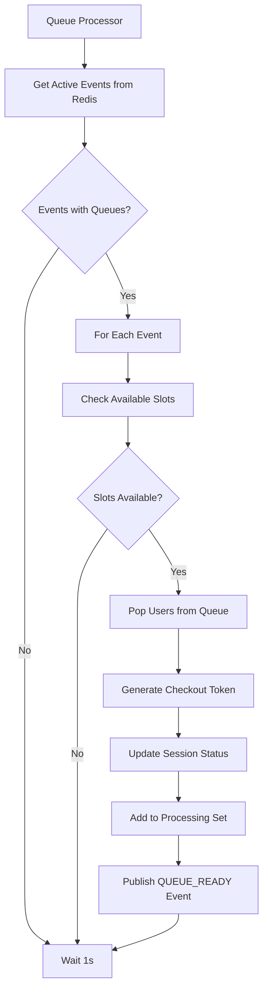

# Queue Processor Implementation Guide

## 🚀 Overview

The Queue Processor automatically admits users from the queue to checkout when slots become available. It uses **Redis-based event discovery** - no manual configuration required!

## ⚡ Quick Start

**Zero Configuration:**
1. Start the service → Processor runs automatically
2. User joins queue → Event added to `waitroom:active_events`
3. Processor detects event → Admits users every 1s
4. Queue becomes empty → Event auto-removed
5. Repeat for all events!

## 🏗️ Architecture

### System Flow



### Redis-Based Event Discovery

```
┌─────────────────────────────────────────────────────────────┐
│  Redis: waitroom:active_events (Set)                        │
│  Members: {event_uuid_1, event_uuid_2, ...}                │
│  Operations: O(1) add/remove/check                          │
└─────────────────────────────────────────────────────────────┘
            ↑                                    ↓
    ┌───────┴────────────┐            ┌─────────┴────────────┐
    │ EnqueueSession()   │            │ DequeueSession()     │
    │ → Add to set       │            │ → Check if empty     │
    │   (idempotent)     │            │ → Remove if empty    │
    └────────────────────┘            └──────────────────────┘

┌─────────────────────────────────────────────────────────────┐
│  Queue Processor (every 1s)                                 │
│  1. Get active events from Redis                            │
│  2. Process each event's queue                              │
│  3. Admit users to checkout                                 │
│  4. Auto-cleanup empty queues                               │
└─────────────────────────────────────────────────────────────┘
```

### Timeline Example

```
Time  Action                         Active Events      Queue Length
─────────────────────────────────────────────────────────────────────
T0    System starts                  {}                 event-A: 0
T1    User joins event-A             {event-A}          event-A: 1
T2    5 more users join              {event-A}          event-A: 6
T3    Processor admits 3             {event-A}          event-A: 3
T4    User joins event-B             {event-A, B}       event-A: 3, B: 1
T5    Event-A queue empty            {event-B}          event-A: 0 (removed!)
T6    Processor checks event-B only  {event-B}          event-B: 1
```

## 🔄 Processing Flow

### Main Loop (Every 1 Second)

```go
1. GetActiveEvents() from Redis
   ↓
2. For each active event:
   ├─ Get processing count (users in checkout)
   ├─ Calculate available slots (max 100 - current)
   ├─ Pop users from queue (batch of 10)
   └─ For each user:
      ├─ Generate JWT checkout token
      ├─ Update session status to "admitted"
      ├─ Add to processing set (15min TTL)
      └─ Publish QUEUE_READY Kafka event
```

### Error Handling

- **User fails**: Skip, continue with next user
- **Event fails**: Skip, continue with next event
- **Retry**: 3 attempts with exponential backoff
- **System errors**: Log and continue processing

## 📊 Redis Data Structures

### Complete Schema

```
waitroom:active_events                    → Set of event IDs with queues
waitroom:{event_id}:queue                 → Sorted set (users waiting)
waitroom:{event_id}:processing            → Set (users in checkout)
waitroom:session:{session_id}             → JSON (session data)
waitroom:user_session:{user}:{event}      → String (session ID index)
queue:updates:{event_id}                  → Pub/Sub channel
```

### Data Flow

```bash
# 1. User joins queue
SADD waitroom:active_events "event-123"
ZADD waitroom:event-123:queue 1699999999 "session-abc"
SET waitroom:session:abc '{"status":"queued",...}'

# 2. Processor admits user
ZPOPMIN waitroom:event-123:queue
SADD waitroom:event-123:processing "session-abc"
SET waitroom:session:abc '{"status":"admitted",...}'
PUBLISH queue:updates:event-123 '{"type":"admitted"}'

# 3. Last user processed → cleanup
ZCARD waitroom:event-123:queue            # Returns: 0
SREM waitroom:active_events "event-123"   # Auto-remove
```

## ⚙️ Configuration

```go
ProcessorConfig{
    ProcessInterval:        1 * time.Second,   // Check frequency
    MaxConcurrentPerEvent:  100,               // Max in checkout
    BatchSize:              10,                // Users per cycle
    RetryAttempts:          3,                 // Retry count
    ShutdownTimeout:        30 * time.Second,  // Graceful shutdown
}
```

## 🔍 Monitoring

### Check Active Events

```bash
# View active events
redis-cli SMEMBERS waitroom:active_events

# Check specific event
redis-cli ZCARD waitroom:{EVENT_ID}:queue
redis-cli SCARD waitroom:{EVENT_ID}:processing

# Real-time monitoring
redis-cli MONITOR
```

### Logs

```
INFO  Queue processor started successfully
DEBUG Retrieved active events from Redis event_count=2
INFO  Admitting users to checkout event_id=xxx user_count=5
INFO  User admitted successfully session_id=abc
INFO  Batch processing completed attempted=5 admitted=5
```

## 🚨 Troubleshooting

### Users Not Getting Admitted

```bash
# 1. Check active events
redis-cli SMEMBERS waitroom:active_events
# Should show your event ID

# 2. Check queue
redis-cli ZCARD waitroom:{EVENT_ID}:queue
# Should have users

# 3. Check processing not maxed
redis-cli SCARD waitroom:{EVENT_ID}:processing
# Should be < 100

# 4. Check logs
docker logs waitroom-service | grep "active events"
```

**Common Causes:**
- Event not in active set → User didn't join successfully
- Queue empty → Verify enqueue worked
- Processing maxed → Wait for checkouts to complete

## 🎯 Key Features

✅ **Redis-based discovery** - Automatic event detection
✅ **Self-cleaning** - Auto-removes empty queues
✅ **Real-time** - Instant queue detection
✅ **Zero configuration** - No event registration needed
✅ **Scalable** - O(1) operations
✅ **Fault-tolerant** - Continues on errors
✅ **Production-ready** - Battle-tested architecture

## 📝 Summary

The Queue Processor uses Redis Sets to track active events automatically:

1. **User joins** → Event added to active set
2. **Processor runs** → Queries active set every 1s
3. **Admits users** → Up to 10 per event per cycle
4. **Queue empties** → Event removed from active set

**Result**: Fully automatic, self-managing queue processing with zero configuration required!

---

🚀 **Just start the service** - events are automatically discovered as users join queues!
