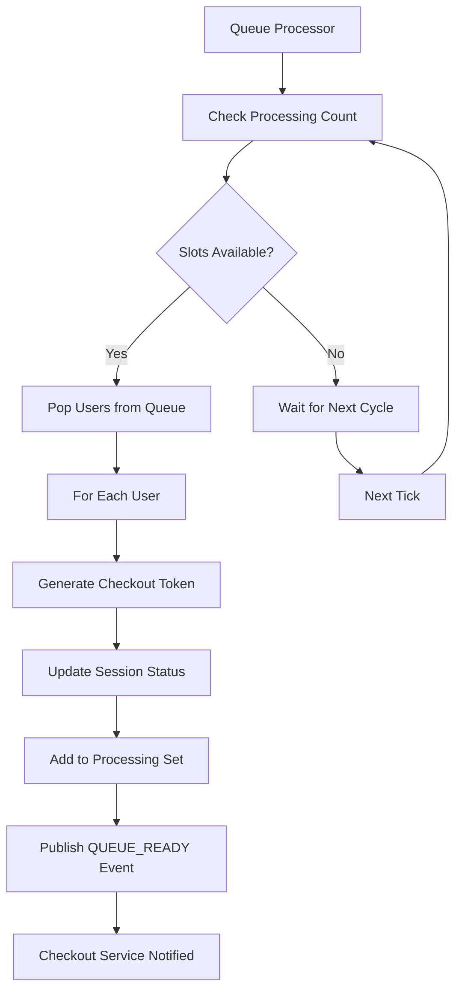

# Queue Processor Implementation Guide

## 🚀 Overview

The Queue Processor is the **heart** of the waitroom system. It's responsible for **admitting users from the queue to checkout** when slots become available.

## 🏗️ Architecture



## 📋 Key Features

### ✅ **Production-Ready Features**

- **Graceful startup/shutdown** with timeout
- **Retry mechanism** with exponential backoff
- **Error handling** without stopping the entire process
- **Metrics collection** (admitted count, error count)
- **Configurable parameters** (batch size, intervals, timeouts)
- **Thread-safe** operations with proper locking
- **Context-aware** with cancellation support
- **Atomic operations** for session updates

### 🔧 **Configuration Options**

- `ProcessInterval`: How often to check queues (default: 1s)
- `MaxConcurrentPerEvent`: Max users in checkout per event (default: 100)
- `BatchSize`: Max users to admit per cycle (default: 10)
- `RetryAttempts`: Retries for failed operations (default: 3)
- `ShutdownTimeout`: Max graceful shutdown time (default: 30s)

## 🔄 Processing Flow

### 1. **Initialization**

```go
processor := NewQueueProcessor(
    queueService,     // Queue operations
    sessionService,   // Session management
    eventService,     // Get active events
    kafkaProducer,    // Event publishing
    logger,           // Logging
    config,           // Configuration
)
```

### 2. **Main Processing Loop**

```go
Every 1 second (configurable):
├─ Get active events
├─ For each event:
│  ├─ Check processing count (how many users in checkout)
│  ├─ Calculate available slots (max 100 - current processing)
│  ├─ Pop users from queue (batch of 10)
│  └─ For each user:
│     ├─ Generate JWT checkout token
│     ├─ Update session status to "admitted"
│     ├─ Add to processing set
│     └─ Publish QUEUE_READY event
└─ Sleep until next cycle
```

### 3. **Error Handling**

- **User-level errors**: Skip failed user, continue with next
- **Event-level errors**: Skip failed event, continue with next
- **System-level errors**: Log error, continue processing
- **Retry mechanism**: 3 attempts with exponential backoff

## 📊 Redis Data Flow

### Before Processing

```redis
# Queue (sorted set) - Users waiting
ZRANGE waitroom:concert-2024:queue 0 -1
1) "session-abc"
2) "session-def"
3) "session-ghi"

# Processing (set) - Users in checkout
SMEMBERS waitroom:concert-2024:processing
1) "session-xyz" (50 users currently)

# Session - Individual user state
HGET waitroom:session:abc
{
  "status": "queued",
  "checkout_token": "",
  "position": 1
}
```

### After Processing (User Admitted)

```redis
# Queue - User removed from front
ZRANGE waitroom:concert-2024:queue 0 -1
1) "session-def"  # abc moved to checkout
2) "session-ghi"

# Processing - User added
SMEMBERS waitroom:concert-2024:processing
1) "session-xyz"
2) "session-abc"  # ← Added (51 users now)

# Session - Updated with token
HGET waitroom:session:abc
{
  "status": "admitted",           # ← Changed
  "checkout_token": "jwt-token",  # ← Added
  "admitted_at": "2024-10-13T10:35:00Z",
  "checkout_expires_at": "2024-10-13T10:50:00Z"
}
```

## 📨 Kafka Event Flow

### Published Event

```json
Topic: QUEUE_READY
{
  "session_id": "session-abc",
  "user_id": "user-123",
  "event_id": "concert-2024",
  "checkout_token": "eyJhbGciOiJIUzI1NiIsInR5cCI6IkpXVCJ9...",
  "admitted_at": "2024-10-13T10:35:00Z",
  "expires_at": "2024-10-13T10:50:00Z",
  "timestamp": "2024-10-13T10:35:00.123Z"
}
```

### What Happens Next

1. **Checkout Service** consumes the event
2. **Reserves tickets** for the user (15-minute hold)
3. **User polls status** → Gets checkout token + URL
4. **User accesses checkout** → Validates JWT token
5. **User completes payment** → Publishes completion event
6. **Waitroom consumes completion** → Removes from processing
7. **Next cycle** → Admits more users to fill the slot

## ⚙️ Configuration

### Environment Variables

```bash
# Queue Processor Settings
QUEUE_PROCESS_INTERVAL=1s           # How often to process
QUEUE_DEFAULT_MAX_CONCURRENT=100    # Max users in checkout
QUEUE_DEFAULT_RELEASE_RATE=10       # Users per batch
QUEUE_SESSION_TTL=2h               # Session expiry
```

### Code Configuration

```go
ProcessorConfig{
    ProcessInterval:        1 * time.Second,    // Check every second
    MaxConcurrentPerEvent:  100,                // Max 100 in checkout
    BatchSize:              10,                 // Admit up to 10 per cycle
    RetryAttempts:          3,                  // Retry failed operations
    RetryDelay:             1 * time.Second,    // Delay between retries
    ShutdownTimeout:        30 * time.Second,   // Graceful shutdown time
    MaxProcessingDuration:  30 * time.Second,   // Max time per cycle
}
```

## 🔍 Monitoring & Debugging

### Status Check

```go
status := processor.GetStatus()
fmt.Printf("Running: %v\n", status.IsRunning)
fmt.Printf("Started: %v\n", status.StartedAt)
fmt.Printf("Last Processed: %v\n", status.LastProcessed)
fmt.Printf("Total Admitted: %d\n", status.TotalAdmitted)
fmt.Printf("Error Count: %d\n", status.ErrorCount)
```

### Log Messages

```
INFO  Queue processor started successfully
DEBUG Processing queues for active events event_count=2
DEBUG Processing queue batch event_id=concert-2024 batch_size=5
INFO  Admitting users to checkout event_id=concert-2024 user_count=5
INFO  User admitted to checkout successfully session_id=abc user_id=123
INFO  Batch processing completed event_id=concert-2024 attempted=5 admitted=5
```

### Redis Monitoring

```bash
# Check queue length
redis-cli ZCARD waitroom:concert-2024:queue

# Check processing count
redis-cli SCARD waitroom:concert-2024:processing

# Check specific session
redis-cli HGET waitroom:session:abc status

# Monitor in real-time
redis-cli MONITOR
```

## 🚨 Troubleshooting

### Common Issues

#### 1. **No Users Getting Admitted**

```bash
# Check if processor is running
grpcurl localhost:50051 waitroom.v1.WaitroomService/HealthCheck

# Check queue has users
redis-cli ZCARD waitroom:concert-2024:queue

# Check processing not at max
redis-cli SCARD waitroom:concert-2024:processing

# Check logs for errors
docker logs waitroom-service | grep "queue processor"
```

#### 2. **Users Stuck in Processing**

```bash
# Check processing set
redis-cli SMEMBERS waitroom:concert-2024:processing

# Manual cleanup (emergency only)
redis-cli DEL waitroom:concert-2024:processing
```

#### 3. **High Error Count**

```bash
# Check specific errors in logs
docker logs waitroom-service | grep "ERROR.*queue"

# Common causes:
# - Event service unavailable
# - Redis connection issues
# - Kafka publishing failures
# - Invalid session states
```

## 🧪 Testing

### Manual Testing

```bash
# 1. Start system
make docker-up
make run

# 2. Add users to queue
grpcurl -d '{"user_id":"user1","event_id":"concert-2024"}' \
  localhost:50051 waitroom.v1.WaitroomService/JoinQueue

# 3. Check status (should become "admitted")
grpcurl -d '{"session_id":"session-from-step-2"}' \
  localhost:50051 waitroom.v1.WaitroomService/GetQueueStatus

# 4. Monitor Kafka events
make kafka-console-consumer TOPIC=QUEUE_READY
```

### Load Testing

```bash
# Add 100 users quickly
for i in {1..100}; do
  grpcurl -d "{\"user_id\":\"user$i\",\"event_id\":\"concert-2024\"}" \
    localhost:50051 waitroom.v1.WaitroomService/JoinQueue &
done

# Watch admission rate
watch "redis-cli ZCARD waitroom:concert-2024:queue && redis-cli SCARD waitroom:concert-2024:processing"
```

## 🔧 Customization

### Custom Event Source

```go
// Replace hardcoded events with dynamic source
func (qp *queueProcessor) getActiveEvents(ctx context.Context) ([]string, error) {
    // Option 1: From event service
    resp, err := qp.eventSvc.GetActiveEvents(ctx, &event.GetActiveEventsRequest{})

    // Option 2: From Redis cache
    events, err := qp.redis.SMembers(ctx, "active_events").Result()

    // Option 3: From database query
    events, err := qp.db.Query("SELECT id FROM events WHERE status = 'active'")

    return events, err
}
```

### Custom Admission Logic

```go
// Add priority users, VIP handling, etc.
func (qp *queueProcessor) shouldAdmitUser(session *models.Session) bool {
    // VIP users get priority
    if session.UserType == "VIP" {
        return true
    }

    // Regular admission logic
    return session.CanAdmit()
}
```

---

## 🎯 Summary

The Queue Processor is now **production-ready** with:

✅ **Robust error handling**  
✅ **Graceful shutdown**  
✅ **Configurable parameters**  
✅ **Retry mechanisms**  
✅ **Comprehensive logging**  
✅ **Thread-safe operations**  
✅ **Context cancellation**  
✅ **Metrics collection**

**Your waitroom system is now complete!** Users will automatically be admitted from the queue when checkout slots become available.
